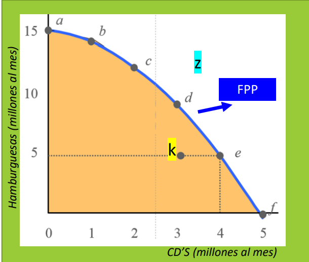

# Clase N° 2

## La Frontera de Posibilidades de Producción (FPP)

###  ¿Qué es la Frontera de Posibilidades de Producción (FPP)?

La FPP es una curva que muestra las combinaciones máximas de dos bienes que una economía puede producir utilizando todos sus recursos de manera eficiente. En la imagen, los bienes representados son hamburguesas y CDs. La curva azul marca la frontera entre las combinaciones posibles y las imposibles de producción.

### ¿Por qué existe la FPP?

La FPP existe porque los recursos son limitados, y cada economía debe tomar decisiones sobre cómo asignar estos recursos entre diferentes bienes. La curva refleja la escasez de recursos y las decisiones sobre cuánto producir de un bien sin comprometer la producción de otro.

### ¿Para qué sirve la FPP?

La FPP ayuda a:

- Visualizar la eficiencia: Muestra qué combinaciones de bienes son posibles con los recursos disponibles (los puntos sobre la curva).
- Ilustrar el costo de oportunidad: Indica cuánto se debe sacrificar de un bien para producir más del otro.
- Decidir la mejor asignación de recursos, maximizando la producción.

### ¿Cómo se usa la FPP?

    

La FPP se utiliza para analizar:

- **Eficiencia**: Los puntos sobre la curva, como a, b, c, d, e, y f, representan combinaciones eficientes. El punto k está dentro de la curva, lo que indica un uso ineficiente de los recursos. El punto z está fuera de la curva y es inalcanzable con los recursos actuales.
- **Costo de oportunidad**: Si una economía desea moverse de un punto como c a d, tendrá que sacrificar una cantidad de hamburguesas para producir más CDs, lo que refleja el costo de oportunidad.

### Supuestos de la FPP

La FPP se basa en cuatro supuestos principales:

1. **Recursos limitados**: La cantidad de recursos es fija.
2. **Eficiencia productiva**: Se utilizan todos los recursos de manera eficiente.
3. **Tecnología constante**: No hay cambios en la tecnología durante el análisis.
4. **Producción de dos bienes**: Solo se consideran dos bienes, como hamburguesas y CDs en este caso.

## Costo de Oportunidad (CO)

### ¿Qué es el costo de oportunidad?

El costo de oportunidad es el valor de lo que se sacrifica para obtener algo más. En la FPP, si se decide producir más de un bien (como más CDs), se debe sacrificar la producción de otro bien (hamburguesas). Esto se refleja en el desplazamiento a lo largo de la curva. Por ejemplo, mover de b a c implica renunciar a producir algunas hamburguesas para hacer más CDs.

    

- La curva azul muestra la FPP.
- Los puntos a, b, c, d, e, y f representan combinaciones eficientes.
- El punto k indica un uso ineficiente de recursos (se podría producir más de ambos bienes).
- El punto z está fuera de la frontera, lo que indica que no es posible con los recursos actuales.

### ¿Por qué el costo de oportunidad tiende a aumentar?

El costo de oportunidad tiende a aumentar porque, a medida que más recursos se destinan a la producción de un bien, los recursos menos adecuados para producirlo deben ser utilizados. En otras palabras, los recursos que son más eficientes para producir el segundo bien (en el gráfico, CDs) ahora están siendo desviados para producir más del primer bien (hamburguesas).

Esto se refleja en la forma cóncava de la Frontera de Posibilidades de Producción (FPP). Por ejemplo, en el gráfico, moverse de b a c puede implicar un pequeño sacrificio de hamburguesas, pero moverse de d a e implica sacrificar muchas más hamburguesas para producir solo unos pocos CDs adicionales. Esta es la razón por la que el costo de oportunidad aumenta cuando se enfoca más producción en un solo bien.

## Costo marginal

El costo marginal es el costo adicional de producir una unidad más de un bien. En otras palabras, mide cuánto cuesta producir una unidad extra de un bien en términos de recursos, tiempo, trabajo, etc. A menudo, este costo aumenta a medida que se produce más de un bien, porque los recursos más eficientes ya se han utilizado, lo que deja recursos menos eficientes disponibles.

### ¿De qué depende el costo marginal?

El costo marginal depende de varios factores:

- **Eficiencia de los recursos**: A medida que se producen más unidades, los recursos menos eficientes comienzan a usarse, lo que aumenta el costo marginal.
- **Economías de escala**: En algunos casos, producir más unidades puede reducir el costo por unidad (economías de escala), pero esto no dura indefinidamente.
- **Tecnología**: Mejoras tecnológicas pueden reducir el costo marginal al aumentar la eficiencia de la producción.

### Costo de oportunidad vs. Costo marginal

- Costo de oportunidad: Es lo que sacrificas al elegir una opción sobre otra. En el contexto de la FPP, si decides producir más CDs, tienes que producir menos hamburguesas. El costo de oportunidad es esa cantidad de hamburguesas sacrificadas.

- Costo marginal: Es lo que cuesta producir una unidad adicional de un bien. Por ejemplo, si decides producir una hamburguesa adicional, el costo marginal es el costo de los recursos adicionales necesarios para producirla (tiempo, ingredientes, maquinaria, etc.).

    

- En el gráfico, moverse de un punto a otro implica decisiones sobre cuántos CDs o hamburguesas producir. Cada vez que te mueves hacia producir más CDs (hacia e o f), estás sacrificando más hamburguesas, lo que representa un aumento en el costo de oportunidad.
- El costo marginal se observa si cada unidad adicional de CDs producida cuesta más en términos de recursos (por ejemplo, sacrificando más hamburguesas). Si se requiere un esfuerzo mayor para producir el siguiente CD, el costo marginal aumenta.

## Beneficio marginal (BM)

El beneficio marginal es la satisfacción o valor adicional que una persona obtiene al consumir o producir una unidad más de un bien o servicio. A medida que consumes más unidades, este beneficio tiende a disminuir porque cada unidad extra suele generar menos satisfacción que la anterior, lo que se conoce como la "disminución de la utilidad marginal". En economía, se utiliza para determinar hasta qué punto es ventajoso continuar produciendo o consumiendo, comparándolo con el costo de hacerlo. Si el beneficio marginal supera el costo, es conveniente seguir; si no, se debe detener.

## Uso eficiente de recursos y eficiencia en economía

El uso eficiente de recursos ocurre cuando los recursos disponibles (como tiempo, dinero o materias primas) se asignan de manera que maximicen el bienestar o la producción, minimizando el desperdicio. En términos económicos, un uso eficiente significa producir la mayor cantidad posible de bienes y servicios con los recursos limitados, sin generar desperdicios o pérdidas innecesarias.

    

- La intersección entre las líneas verde (BM) y roja (CM) representa el punto de eficiencia. Este punto indica el nivel de producción (en este caso, CDs) en el que el beneficio adicional de producir una unidad más de CDs es igual al costo adicional de hacerlo.

- A la izquierda de la intersección (entre 1.5 y 2.5 millones de CDs), el beneficio marginal excede al costo marginal. Esto significa que producir más CDs en este rango es beneficioso porque los consumidores obtienen más valor (satisfacción) de cada CD adicional en comparación con lo que cuesta producirlo. Aquí, se puede considerar que todavía no se ha alcanzado la eficiencia porque se pueden generar más beneficios al producir más CDs.

- A la derecha de la intersección (más de 3.5 millones de CDs), el costo marginal excede al beneficio marginal. Esto indica que producir más CDs a partir de este punto genera un costo más alto que el valor o satisfacción que reciben los consumidores. Aquí, ya no es eficiente continuar la producción, ya que los recursos se están utilizando de manera que no maximizan el bienestar.

### Uso eficiente de los recursos según el gráfico

El gráfico ilustra cómo una economía puede buscar el uso eficiente de sus recursos. Al producir hasta el punto donde el beneficio marginal iguala el costo marginal, la economía asegura que cada unidad adicional de producción (en este caso, CDs) genere tanto valor como el costo de producirla. Más allá de ese punto, el uso de los recursos ya no es eficiente, ya que el costo de producir más CDs supera el valor que se obtiene de ellos.

##  Crecimiento económico: Expansión de la producción

    

El crecimiento económico se refiere a la capacidad de una economía para producir más bienes y servicios a lo largo del tiempo. En el gráfico, esto se muestra como un desplazamiento hacia la derecha de la Frontera de Posibilidades de Producción (FPP), de FPP₀ a FPP₁.

Este desplazamiento indica que la economía ha aumentado su capacidad productiva, lo que le permite producir más máquinas productoras de CDs y CDs en el futuro, sin tener que sacrificar uno para producir el otro. Es decir, tras la inversión, la economía puede alcanzar puntos como a' o b', donde se pueden producir más CDs y más máquinas que en la frontera inicial FPP₀ (puntos a y b).

### Costo del crecimiento económico

El crecimiento económico tiene un costo, ya que para expandir la capacidad productiva futura, es necesario renunciar al consumo presente. En el gráfico, este sacrificio se ve cuando la economía decide pasar del punto b en FPP₀ al punto b' en FPP₁.

En el punto b, la economía produce 6 millones de máquinas productoras de CDs y 4 millones de CDs.
Para poder producir más en el futuro, la economía debe invertir en capital, lo que significa producir más máquinas ahora y menos CDs (moverse hacia la derecha, al punto b').
El costo aquí es que la economía debe renunciar a la producción de CDs actual (pasa de producir 4 CDs a menos) para construir más máquinas (produce 6 máquinas), lo que le permitirá fabricar más CDs en el futuro.

### Causas del crecimiento económico

Existen dos causas principales del crecimiento económico, ambas reflejadas en el gráfico:

1. Aumentar los factores productivos
Esto implica invertir en más recursos que permiten producir más en el futuro, como capital físico (máquinas, fábricas), capital humano (trabajadores más capacitados), o tecnología. En el gráfico, vemos esto representado por la decisión de producir más máquinas (punto b) y menos CDs.
Al producir más máquinas, se mejora la capacidad de la economía para producir más en el futuro. El resultado es que la FPP se desplaza hacia afuera (de FPP₀ a FPP₁), lo que significa que la economía puede producir más tanto de CDs como de máquinas en el futuro (puntos a' y b').

2. Aumentar la productividad
Esto ocurre cuando la economía mejora su eficiencia en el uso de los recursos, lo que significa producir más con los mismos recursos, gracias a avances tecnológicos o mejoras en la organización y los procesos. En el gráfico, un aumento en la productividad también puede desplazar la FPP hacia la derecha, incluso sin aumentar los recursos.
Este desplazamiento permitiría a la economía producir más máquinas y más CDs sin tener que aumentar la cantidad de recursos disponibles, lo que implica un crecimiento económico sin necesariamente sacrificar consumo presente.